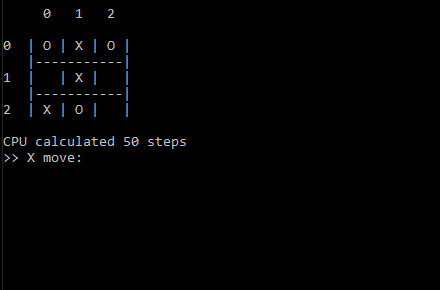

# TicTacToe with AI
Implementation of a tic-tac-toe game, using C++. 
***
The purpose of this project was to understand and practice the use of recursion in the minimax algorithm. The "AI" operate by maximizing its chance of winning while minimizing the player's.
*

